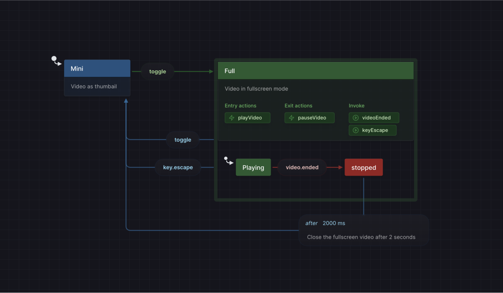
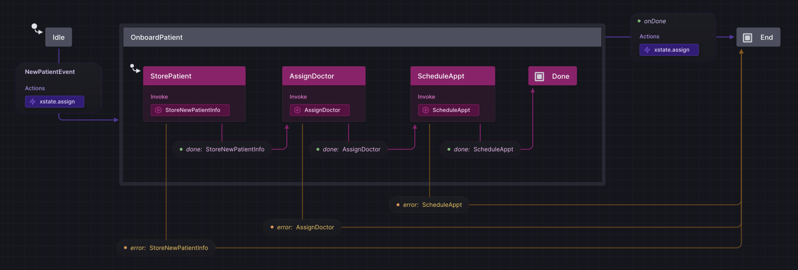
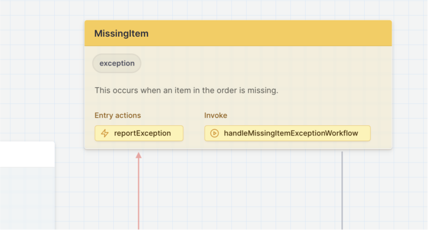
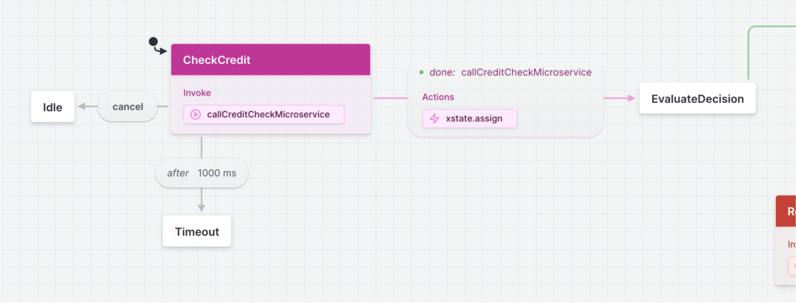
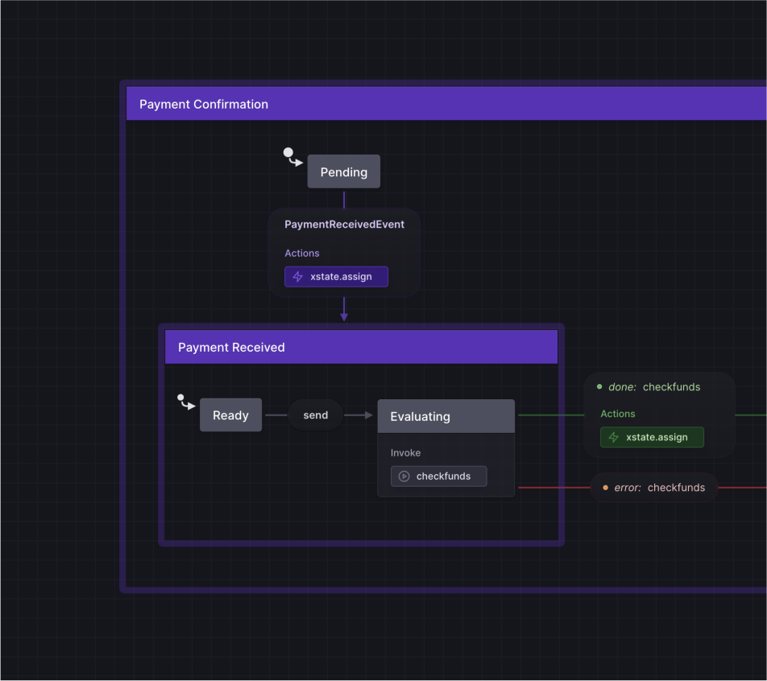
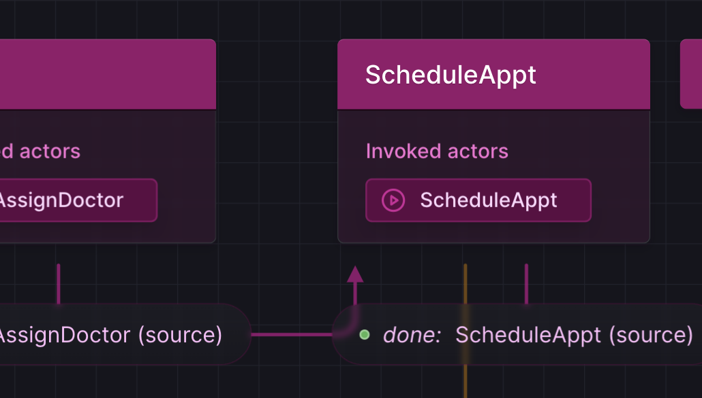

# Supercharge the canvas

Today we are excited to release an update to Stately that takes a huge step toward making complexity more manageable. 

- Bring color into your flows! 🌈
- Design more logic directly on the canvas 📝
- Interact with effects (like entry actions and invoked actors) as visual blocks 🧩
- Understand complex flows with a refined statechart design 🔥
- Hide the UI to focus on your content 🎧
- Improved transition routing ↵
- Use tags, action parameters, and many XState actions in the Studio 💪<!--truncate-->
- Export to XState v5 beta 🚚

## Making complexity manageable

We believe that making logic explicit using state machines, statecharts, and other visual flows can bring huge benefits like:

- Improving collaboration through a shared understanding.
- Tapping into our innate visual processing capacities with a spatial format.
- Streamlining product creation by helping to sync effort across teams, platforms, and workflows.
- Generating code, tests, documentation, and other artifacts.

But much of what we build is complex. And when we represent it visually, the result can itself be complex.

One of our goals at Stately is to make this inherent complexity you face more manageable. We want to help you simplify where possible, automate when useful, and elevate your thinking and communication. 

Today we are launching an updated design for Stately Studio’s visual canvas that lays a foundation we will build on over the next wave of releases.

## Create from the canvas to stay in the flow

You can now do much more work on the canvas itself. 

Being able to stay on the canvas keeps you closer to your content, lets interactions be more intuitive, can help you stay focused, and can even give you more room to work. 

For example, we enhanced the Edit Menu to support adding [actions](/docs/xstate-v5/actions#using-actions-in-stately-studio), tags, and other data to [states](/docs/xstate-v5/states#using-states-in-stately-studio) and [transitions](/docs/xstate-v5/transitions#using-transitions-and-events-in-stately-studio). And most items on the canvas can then be edited directly.

<video src="https://ascelcgzufjyvdzuplwo.supabase.co/storage/v1/object/public/videos/create-from-canvas.mp4" width="720" controls preload="none">
  
<a href="https://youtube.com/watch?v=ck9uGikxJ8k">Watch this video on YouTube.</a>

</video>

## Effect blocks make it easy to say what happens when

Statecharts are great for modeling how a process goes from state to state when an event occurs. Especially since you can also make things happen by having effects run at specific times. 

The most important addition we’ve made with this release is that effects ([invoked actors](/docs/xstate-v5/invoke#using-invoked-actors-in-stately-studio), entry actions, and exit actions) are now interactive. They are represented as blocks on the canvas that can be placed inside states and transitions. 

This will make it easy to define, understand, and modify your app’s behavior as users step through your flow. 

Effect blocks are editable, can be copied, and handle standard keyboard interactions, just as you’d expect. And rumor is, soon you’ll be able to drag them around, enhancing your codebase with a new spatial dimension. Imagine changing when a JavaScript function is called simply by dragging it to a new place in the flow. 🤫

Speaking of upcoming features, if you follow [our live streams](https://youtube.com/statelyai/?source=blog), you’ve already seen [a preview of writing code inside the Studio using the new effect blocks](https://www.youtube.com/live/FY030no59Y4?feature=share&t=1876). But we decided to take this functionality even further before releasing it, so stay tuned!

## Streamlined visualization makes complex flows easier to understand

One bit of feedback we consistently get is that statecharts are helpful, but that sometimes it can be difficult to understand what’s happening when a lot of content is visible at once. We also think it’s important that even non-technical contributors be able to use statecharts to build and understand their products. 

So we’ve turned over every aspect of how statecharts are represented on the canvas, trying to figure out how to balance the need to show a dense variety of information in a way that is not overwhelming. 

One change is that the name of the state is now a header, and most of the other data on it (tags, [description](/docs/xstate-v5/descriptions), effects, and so on) are grouped together as part of a new detail section.

This means that when you first open the flow, it’s easy to focus on the state names for a quick overview of how they are connected. Then when you want more detail, you can narrow your attention to what interests you.

We’ve also heard feedback that sometimes it can be hard to tell a state from a transition. One reason is that with Stately, unlike other diagramming tools, transitions can have many of the same properties as states (such as actions and descriptions). This gives a powerful option for modeling but can introduce challenges with ambiguity. We mitigated this, however, by adopting a style where states “pop out” while transitions “blend in”.

Effect blocks, on the other hand, have the same style no matter where they are placed since their location simply says when they are executed. This consistency makes it easy for contributors with various backgrounds to intuitively understand “what happens”.

And you may notice many other small and not-so-small details. For example, a chunky border around each level in the hierarchy gives a new sectioned-off look. This will be useful in the future as we add support for more dynamic views. 

And one principle we used to guide us was that, because statecharts already involve so many boxes and arrows, any sharply defined line should be significant for the flow. That means we generally looked for other solutions for separating sections.

We think we’ve built something that will increasingly be able to support however you want to use Stately, smoothly growing from casual brainstorming sessions to business-critical production actor systems filled with multi-leveled machines.

## Translucency reduces ambiguities

Another part of the improved design is translucency. Because Stately handles the complex, nonlinear flows often required when building apps, it is not always possible to lay out your logic in a nice straight line. This means that arrows can go underneath other items, making the content difficult to read. Also, when working on a canvas, sometimes it’s nice to casually toss items into overlapping piles as your work comes together. But statecharts can get pretty detailed! And this means sometimes states can cover each other up, and it’s hard to even tell anything is underneath.

That’s why we made some canvas elements translucent by default, including state details and transition labels. 

It's still usually better to avoid overlapping content. And to help content not overlap in the first place, we've also enhanced transition routing. 

But with translucency flows should be easier to follow when it happens.

## Hide the UI to work without distraction

For when you just want to focus on the content, we’ve added a way to hide the Stately UI, including the header bar, side panels, and canvas controls. 

Try hiding the UI from the Stately menu in the top left of the editor, or just press `⌘` + `.`  to toggle it instantly. We also support `⌘` + `\` for the same behavior if you prefer using that shortcut.

## Get more of XState’s power inside the Stately Studio

We are continuing to bring more of XState into the visual Studio. 

Tags are now supported in the Studio to help you categorize different state nodes. For example, you can add a “loading” tag to each state representing loading data. 

And the Studio now supports action parameters and several categories of [actions that are built into XState](/docs/xstate/actions/built-in-actions):

- assign
- raise
- log
- sendTo
- stop
    
You can [learn more about tags and the actions built into XState in our documentation](../docs/xstate/actions).

Also, you can try exporting your machines to XState v5 beta. Note that support for importing from v5 beta is coming soon.

## Design in color

Finally, we have an enthusiastic community, and one request we’ve heard again and again was the need for color in flows. 

Color is finally here! 🌈

And it doesn’t just look pretty. There are so many ways that color can help you. For example, you can try:

- Setting transition colors to help identify a common target
- Setting transition colors to show a shared source
- Connect a color to a meaning, such as making error states red
- Organize flows into regions with distinct colors
- Use different colors for different user personas or stories
- Mark popular paths with colors based on usage data

We think you’ll find that color is especially useful when building with others, such as collaborating with team members or presenting to clients. It provides a nice way to convey new layers of meaning. And a colorful image makes the modeling that Stately supports more appealing for non-developers, getting everyone on board and building an attractive bridge between different audiences.

Because color will be used in diagrams in dynamic and varied ways, we implemented our approach using a perceptually uniform color space. This means that no matter which color you choose, in light mode or dark mode, you don’t have to worry about contrast changes affecting legibility. This is because all colors in any group are perceived as being the same lightness. 

Set a color by selecting a state or transition and choosing the one you want from the Edit Menu above it. You can set colors separately on states and on transitions. Effect blocks and other attached details inherit their color. 

<video src="https://ascelcgzufjyvdzuplwo.supabase.co/storage/v1/object/public/videos/colors-2.mp4" width="720" controls preload="none">
  
<a href="https://youtube.com/watch?v=Yiij2FaGSd0">Watch this video on YouTube.</a>

</video>

Colors are just for Pro subscribers. So if you haven’t signed up yet, [try it out with a free 30-day trial](https://stately.ai/pricing)!

## Try out Stately now

With the improved design and new functionality, Stately is even more useful for teams throughout the entire product lifecycle. But this is still just the start of what we’ve been working on this year. 

[Stately is free to try, so check it out](https://stately.ai). We’re sure you’ll find many ways it can help you. And if there is anything you would love to see added, please [join our Discord community](https://discord.gg/xstate) or [reach out directly](mailto:support@stately.ai) and let us know!
