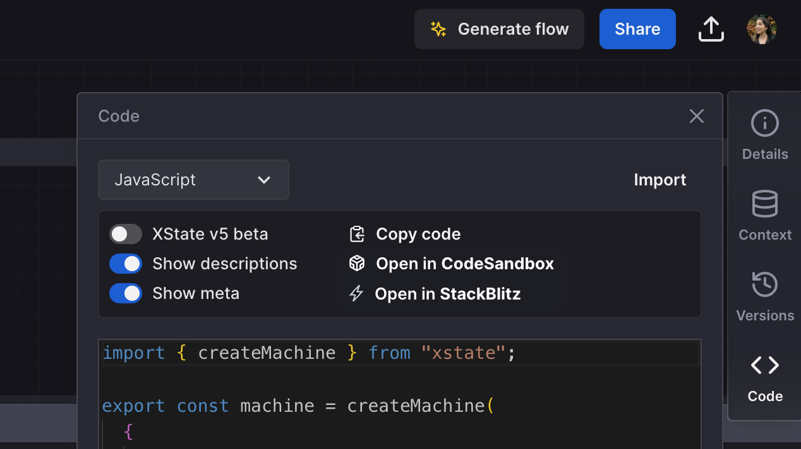
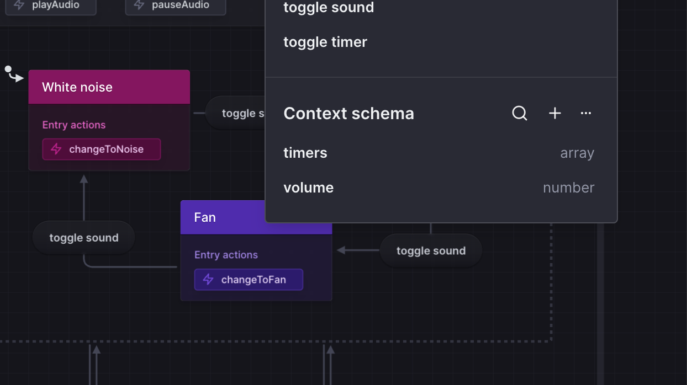
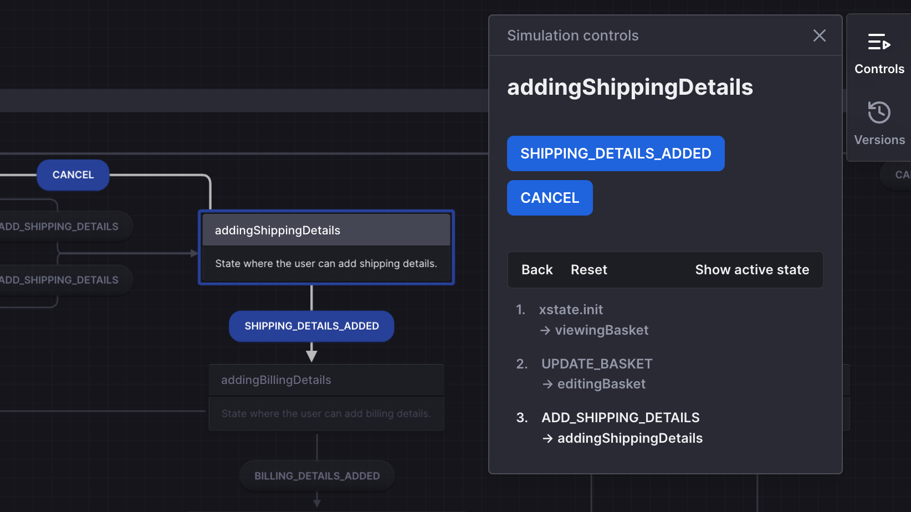

You can now open your machine in CodeSandbox or StackBlitz. These options show when you select either JavaScript or TypeScript export formats in the **Code** panel. When you open your machine in these external editors, it will be deployed as a demo app so you can jump quickly into prototyping and get an example of how to integrate your machine into your codebase.

<!--truncate-->

## Context schema

We’ve now released the context schema in the editor. You can find the context schema above the event schemas in the machine **Details** panel. Here, you can add a new context property with its name, type (string, number, boolean, array and object), and an optional description. These will then be exported in your TypeScript code. When you import a machine, Stately will stub an empty schema for any context properties in your code. If you add a context property in the **Context** panel that’s missing from the context schema, a quick link will appear under that property to quickly add it to the schema.

You can edit any context properties in the modal that opens when you click the property in the schema list. To delete all schema properties, use the **Delete all** option under the **...** menu.
In the Context schema panel, you can also search through the list of context properties in your machine by name.

## Improved Simulation mode

We’ve made some improvements to Simulation mode. The log panel is now named the **Simulation controls** and not only shows a log of your simulated path but contains buttons to navigate through the currently available events easily.

## Bug fixes

We had a brief bug with importing large machines from the import modal. If you experienced any errors with importing machines, please try again now! If you are still experiencing any bugs, please let us know at support@stately.ai.

- Fixed a bug where Stately could enter a loop if metadata fails when attempting to load a particular version URL.
- Fixed a bug where previous versions that contained actions could throw errors.
- Fix a bug where transition lines were lost after restoring a version and then hitting Undo.
- Inline actions have been removed from exported JSON code.
- Machines featuring raise callbacks will now export correctly to TypeScript.

## Improvements

- You can now choose to display your state’s meta information on the canvas. Add your meta information in the **State details** panel, and enable or disable from the editor menu > View > **Show/Hide meta on canvas**.
- You can now right-click on states and events in the tree view and **Center to view** to center that state or event in the canvas view.
- We’ve improved the OpenAI integration, so generated flows are now more accurate.
- The length of long expressions rendered on the canvas and in toolbox blocks are now truncated.
- We’ve improved the performance around importing a machine from code, so importing your machines should now be much faster.
- Context is now supported in imported machines.
- We’ve added more information about the [features available to our Enterprise customers](https://stately.ai/registry/billing).
- A medley of internal fixes and improvements.
