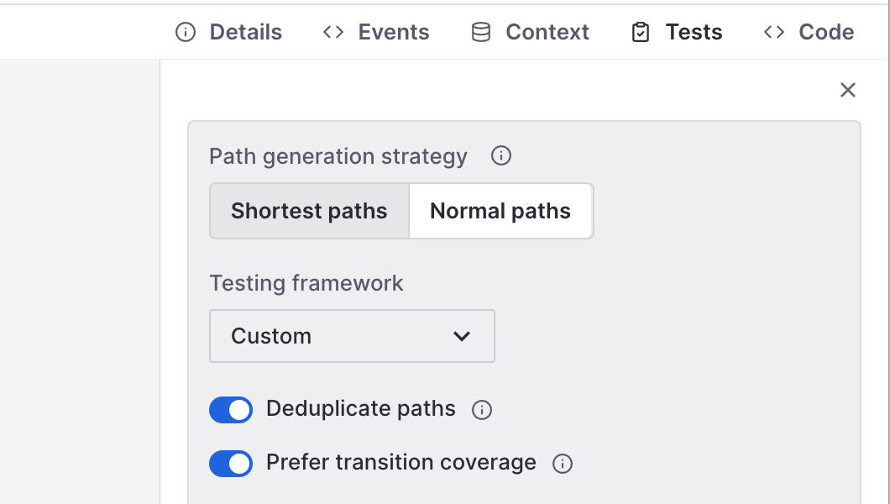
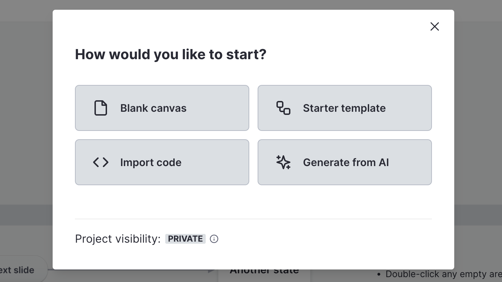

It’s been a while since our last changelog update, so let’s get right to it!

{/* truncate */}

## Generate test path code from your machines

You can now generate test path code for your state machines, which you can use to implement tests:

- Choose between the shortest or simplest path generation strategies
- Choose between default and Playwright test code templates (more to come, including Puppeteer, Cypress, and even other languages)
- Optional AI-generated test titles and descriptions
- Optional transition coverage

This feature is in beta, and we’d love to get your feedback on [our Discord server](https://discord.stately.ai).

## Editor UI improvements

As shown in the preview above, we’ve started improving the editor UI, and this is just the first phase! We’ve added a secondary header and bottom status bar where you’ll now find the version history. The left and right panels are now adjustable full-height panels. You can now find the machine in the new **Project** panel on the left. We’ve also moved the **Events** schema into a panel in the right toolbox and the context schema into the **Context** toolbox panel.

## Creating new machines is easier than ever!

Now, when you add a new machine, you can quickly create a machine from a blank canvas, the starter template, import from code, or generate with AI.

## Improvements to internal and external transitions

Transitions in the editor now have three values:

- Internal
- External
- Auto

You can set internal or external explicitly or leave them as auto. In the future, we’ll provide smarter options for how XState behaves for auto values.

When exporting to code, we only include the internal property on transitions you have explicitly set to internal. Transitions set to auto ones will be omitted and fall back to default XState behavior in the run time.

## Improvements

Recently we’ve been focusing a lot on performance, especially for large machines with more than 100 states and events. We’ve made it easier to interact with states and events in these large machines, especially when you’re zoomed in.

We now persist some of your editor preferences on your local device, including:

- Show/hide UI
- Show metadata on canvas
- Show grid
- Show left panel
- Your last used code panel settings

And there’s more!

- When team-owned machines are auto-saved, we now show the user’s avatar instead of the Bot avatar.
- The code editor is now improved for better usability and performance.
- Long machine names now overflow more gracefully.
- You can now give your new machine a name when forking an existing machine.
- We have improved the heuristics for showing paths in large machines.
- You can now import code even if you are not logged into Stately.
- We now prevent you from accidentally deleting used events from the event schema.
- Pro users can now select individual files and folders to import when importing a project from GitHub. You can also modify those selections at a later time.
- You can now save a new machine to a project from the Code panel before exporting your machine as code.
- The name of the machine you’re saving is now shown in the Save machine modal when saving from the top bar or the right-side code panel.
- You can now provide your own GitHub token for authentication.
- We have improved the color of draglines in light mode to make them easier to see.

## Bug fixes

- Fit to content now works again in embed mode.
- We’ve brought back the control buttons in embed mode.
- States and events will now correctly focus when created.
- Draglines now show even when you’re panned far away.
- Zooming in now works when your zoom level is less than 10%.
- We’ve added the option to add colors from the right-click menu for Pro users again.
- We fixed an issue where sometimes clicking on a button on the canvas didn’t register.
- The context property is now correctly validated in the context schema.
- We fixed a bug in exporting expressions.
- We fixed a bug where creating a new machine from AI generation overwrote the current machine.

## Services

You might have also spotted a new **Services** option on our Billing page. Don’t hesitate to [get in touch with us by email](mailto:support@stately.ai) if you’re interested in any of the following:

- Consultancy on state management and/or using XState in your team
- Workshops for XState V4 and XState V5 beta
- Custom solutions for state machine logic and model-based testing
- Priority support

We’d love to hear from you!
