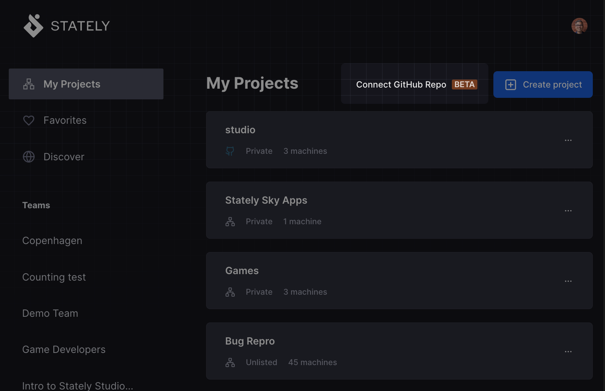
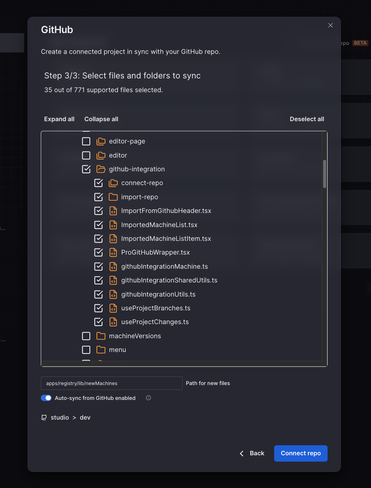
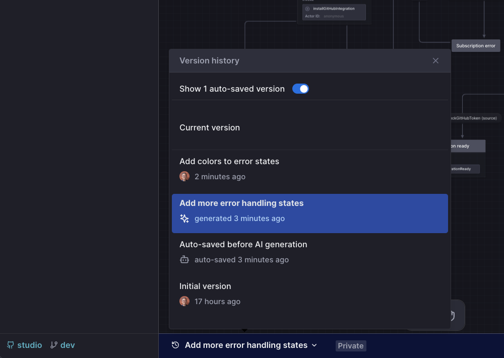
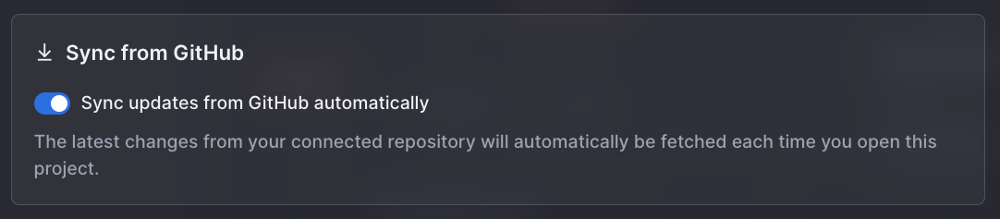
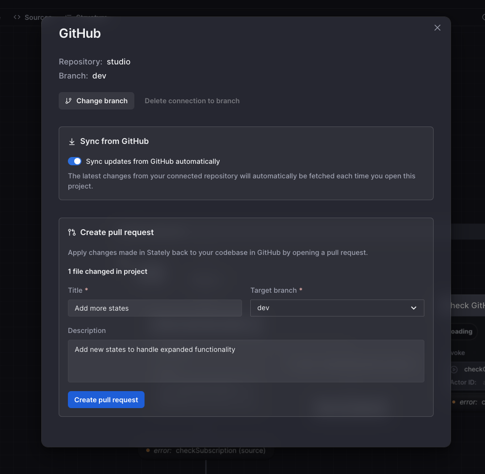
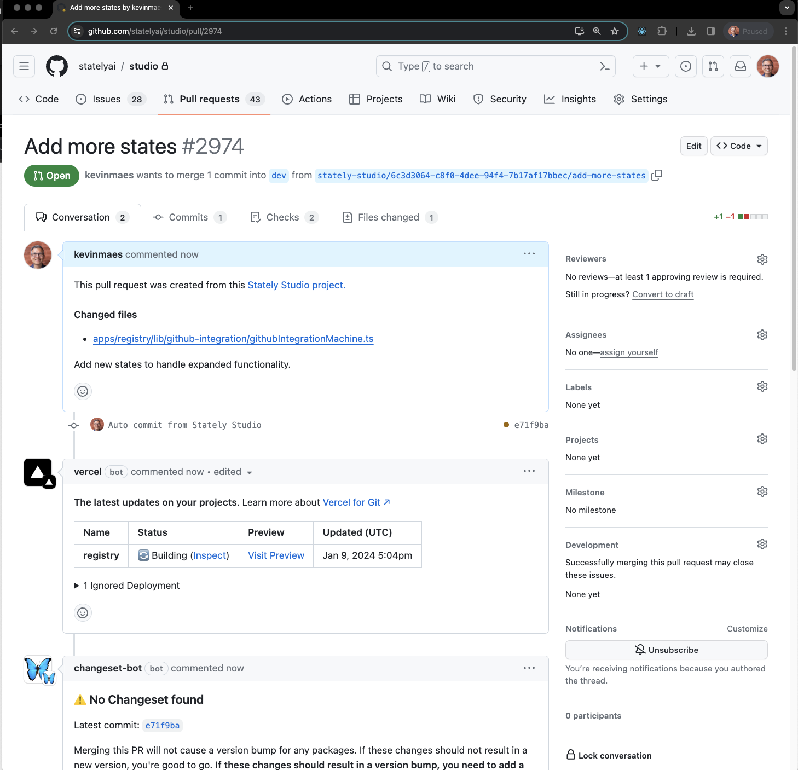

The team at Stately is proud to release an exciting new feature to kick off 2024, [GitHub Sync with Stately Studio](https://stately.ai/docs/import-from-github)! This feature has been highly requested by users and it prompted us to initially launch GitHub Import as a Pro feature over a year ago. But GitHub Sync goes beyond just importing as it enables a completely bidirectional workflow between GitHub repositories and Stately Studio. View the [short demo of GitHub Sync](https://www.youtube.com/watch?v=x-F1TPjz_lI&t=318s) from our Office Hours last month.

{/* truncate */}

### Manual syncing is so 2023

Adoption of state machines and XState in the TypeScript/JavaScript community has steadily grown over the years and there are thousands of repositories on GitHub alone that use XState in projects. Stately Studio also continues to gain adoption as its free and premium features make working with state machines and XState even more powerful and intuitive. Until now, users have sought to synchronize work between their repositories and Studio, in either or both directions, but it hasn’t always been easy. This often involved copy/pasting code, importing/exporting machines to and from Studio, and reconciling multiple sources of truth. GitHub Sync seeks to eliminate those pain points.

### Project code enhanced by Stately Studio

Stately Studio is packed with powerful features like its robust editor for visualizing state machines as diagrams, flow simulation, and export options and test generation. Studio also allows for easy organization of machines into projects, save versions, and collaborate with other team members. Many XState users have been able to use the diagramming features of our VSCode extension but now GitHub Sync makes it easier to enjoy all of the Studio features while using any code editor and remaining connected to the GitHub repo as a source of truth.

### Code synced for the entire team

Depending on the type of software being developed or depending on team size, XState may only be used in a portion of the project’s code. The project’s repo may be used by many other team members who aren’t yet using Stately Studio’s features. Changes to the code could be made directly by those contributors to the GitHub repo and they need to be synchronized with Studio on an ongoing basis. For users on a Team plan who already collaborate in Studio, their machines also need to be synced back to their repos. Git and GitHub already include intuitive tools for merging code and for conflict resolution so Studio is now able to leverage those to keep everything in sync.

## What’s included in the new GitHub Sync release?

### A more robust importing process

Importing from a GitHub Repo is now easier and more robust. Users can automatically authorize Stately Studio with a single click or they can choose to use a customized GitHub access token with fine grained repository access and permissions. Access allows users to then choose one of their GitHub repositories, including a specific branch, and then select which files and folders to include for import. The Studio will identified all of the XState machines in the repo files, extract them, and create a connected project. Connected projects work just like other Studio projects but with additional GitHub-related features.

### Editing power of Stately Studio

Once a connected project has been created, its machines can be edited just like with other projects and machines. Use the visual editor to add or modify states and transitions. Effects can be added and a machine’s layout can be automatically or manually adjusted. Flows can be created or modified with AI generation. With a [Stately Studio Pro plan](https://stately.ai/docs/studio-pro-plan), machines versions can be saved and machines can even be run via Stately Sky.

Studio also provides a number of other features like test generation and export options to code, markdown, or to external editors. But this work can all be in coordination with the underlying GitHub repo.

### Staying in sync with the GitHub repo

By default, connected projects will automatically be synchronized with the GitHub repo every time the project loads. New files added to selected folders in the repository will appear in Studio. We’ll also warn of any deleted files that might cause machines to be deleted in Studio. It’s possible to opt out of this and to perform syncs manually but we recommend that this still be done fairly often to prevent potential conflicts.

A connected project starts out in sync with the branch that was specified during the import process. However, it is also possible to connect to additional repo branches. Under the hood, these branch connections are considered a different version of the connected project and it’s easy to switch between them, add new branches, or delete branch connections.

At any time, new machines can be added directly to a connected project or existing machines can be moved or forked into a connected project. Those can all be added to the GitHub repo as part of the pull request process.

### Creating pull requests back to the repo

The key feature required to complete a bidirectional workflow between GitHub and Stately Studio is the ability to create pull requests back to the original repository and that’s now easy to do directly from Studio. Connected projects have a GitHub Settings panel where you can manage the GitHub connection to your project, including creating a pull request which can target any other branch in the repository.

Once a pull request is made, the process becomes the same as it is for any other GitHub pull request where it can be reviewed, modified, approved, and merged. Subsequent changes can be added to existing pull requests with the Update pull request feature. This allows for greater productivity in Studio while knowing that changes will make their way back into the GitHub repo.

## What’s next?

We can’t wait for you to try out GitHub Sync with your Studio machines and repositories. If you’re a Pro user you can get started immediately. Community users can get a free trial for our Pro or Team plans during which time you can import machines into Stately Studio to use GitHub Sync along with all of our other [Pro features](https://stately.ai/docs/studio-pro-plan) or [Team features](https://stately.ai/docs/studio-team-plan).

But the fun doesn’t stop there. It will soon be possible to modify file and folder selections after importing from a GitHub repo into a connected project. Another feature we are considering is the ability to convert regular Studio projects into connected projects which would create a new GitHub repository or add new branches to an existing repo. We’d love to hear how GitHub Sync is working for you and also what [other features would be useful for you](https://github.com/statelyai/feedback/issues/new/choose) and your team.
