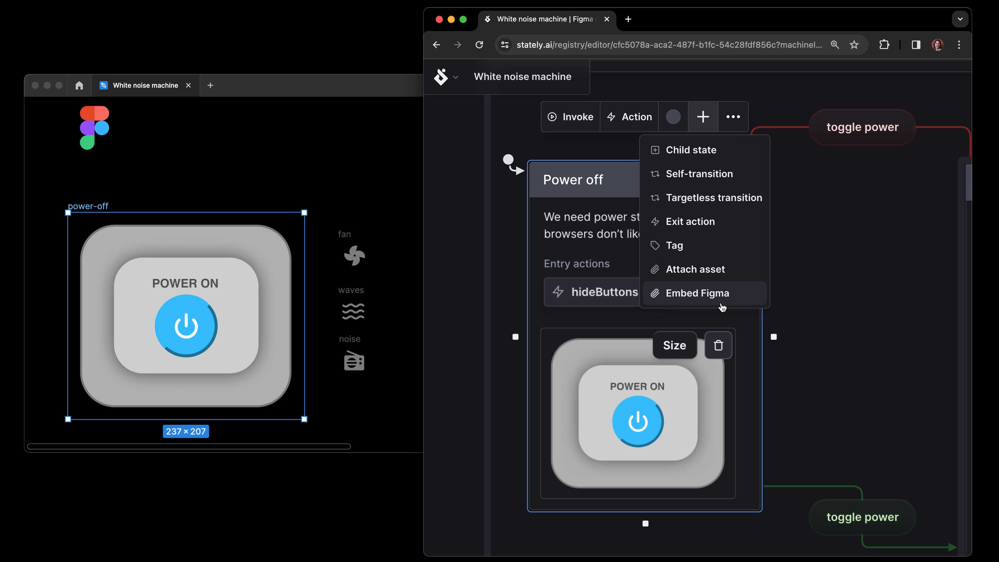

Embedding Figma frames has arrived in Stately Studio! We’ve also made more improvements and squashed some bugs. And have you tried [Stately Agent](https://www.youtube.com/live/c05bOPeinSA?si=Ti3otk_1-CE2mm00&t=122) yet?{/* truncate */}

## Embed Figma frames

Last week, we released our Figma integration, so you can now embed your Figma frames in Stately states. Your frames stay in sync with Figma, so you can be sure you always have the latest version of the design and your whole team is working from the same source of truth. [Read more about the launch of our Figma integration](2024-01-25-embed-figma).

## Improvements

- We improved the modals for premium features so you can quickly learn more about what these features do and how they work.

## Bug fixes

- We fixed the issue where importing code could result in the creation of extra empty machines.
- You can now change the selected machine even if there was an error saving your machine.
- The exported code implementations will no longer include unused guards, actors, and actions.
- Interacting with a machine from the structure panel will no longer cause an error when changing repos synced with GitHub.

## We’d love your feedback

Do you have a feature request you want to share with us? [Submit and upvote feature requests on our dedicated GitHub feedback repo](https://github.com/statelyai/feedback). Want to be the first to find out new features? Join us at our next office hours live stream. Find out when streams are planned by subscribing to [our YouTube channel](https://www.youtube.com/@Statelyai) or [Twitch channel](https://www.twitch.tv/statelyai) or [following us on LinkedIn](https://www.linkedin.com/company/statelyai/).
