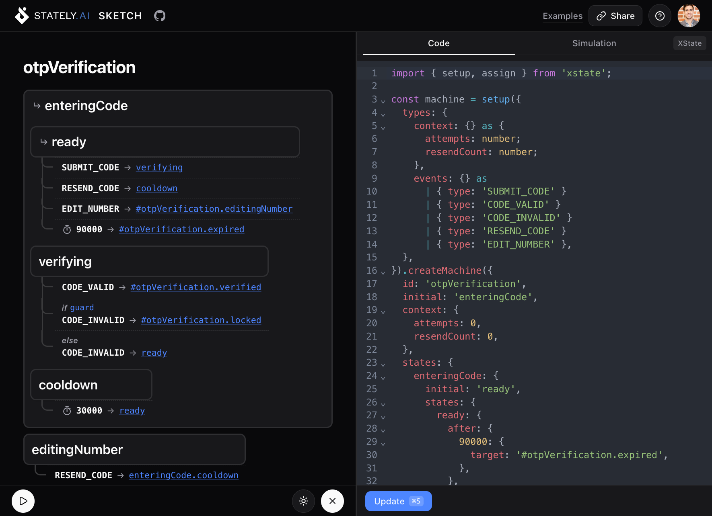
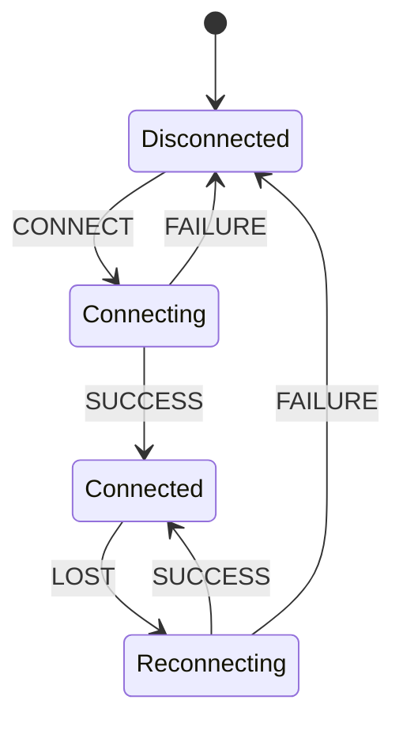
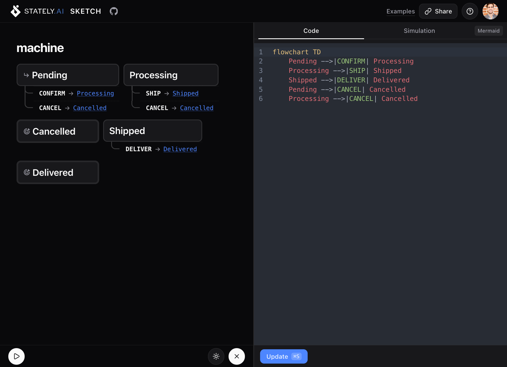
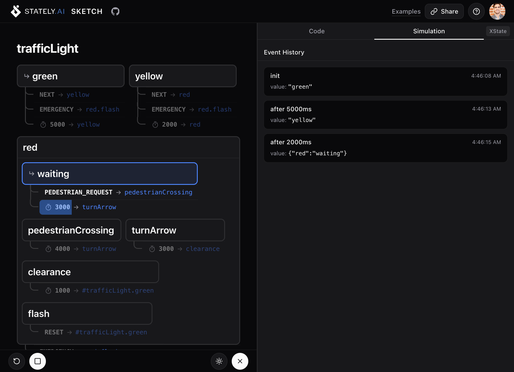

We've always believed that state machines should be visual. But sometimes you just want to paste some code and see what it looks like; no account, no setup, no heavy editor. That's why we built **Stately Sketch**: a lightweight, open-source visualizer and simulator for state machines that works everywhere, including your phone.{/* truncate */}

## What is Stately Sketch?

[Stately Sketch](https://sketch.stately.ai?utm_source=stately-blog) is a web app where you write (or paste) state machine code on the left and instantly see an interactive diagram on the right. Click a transition, and the machine simulates it. That's it. No install, no login required. If you do sign in, you can save and share your machines with a permanent URL.

It's built for the moments where you want to quickly:

- **Visualize** a machine you're working on in your codebase
- **Simulate** transitions to verify your logic is correct
- **Share** a diagram with a teammate via URL (sign in to save)
- **Sketch out** a new machine idea from scratch

## Works with the code you already have

Stately Sketch automatically detects and supports multiple formats:

- **XState** : full XState v5 `setup().createMachine()` syntax
- **JSON**: raw XState machine configuration objects
- **YAML**: the same configs in YAML form
- **Mermaid**: `stateDiagram-v2` and `flowchart` diagrams

This means you can paste a Mermaid diagram from your existing docs:

And Stately Sketch will turn it into an interactive, simulatable diagram.

## Simulate your machines

Switch to **Simulation** mode and your diagram becomes interactive. Click any available transition to send that event. Sketch highlights the current state, shows guard evaluation, animates delayed transitions with progress bars, and logs your event history.

This is invaluable for catching logic bugs before they make it to production. Wondering if your login flow handles a lockout after too many attempts? Click through it and find out.

## Lightweight and responsive

Stately Sketch is intentionally minimal. It loads fast, runs smoothly, and the resizable panel layout collapses gracefully on smaller screens. You can review a state machine on your phone during a code review, or sketch out an idea on a tablet while away from your desk.

## Share your sketches

Hit **Share** to save your sketch and get a URL. Send it in a PR comment, drop it in Slack, or bookmark it for later. No account needed to view shared sketches.

## Open source

Stately Sketch is fully open-source under the MIT license. The entire codebase is on GitHub:

**[github.com/statelyai/sketch](https://github.com/statelyai/sketch)**

It's built with [@xstate/store](/docs/xstate-store) and [TanStack Start](https://tanstack.com/start). Contributions are welcome; check the repo for guidelines.

## Try it now

Head to **[sketch.stately.ai](https://sketch.stately.ai)** and paste in your machine code. Or pick one of the built-in examples (session timeout, OTP verification, checkout flow, and more) to get a feel for the tool.

[Let us know what you think on our Discord server](https://discord.stately.ai) or [open an issue on GitHub](https://github.com/statelyai/sketch/issues). Want to stay in the loop? Follow us on [Twitter](https://twitter.com/statelyai) or subscribe on [YouTube](https://www.youtube.com/@Statelyai).
