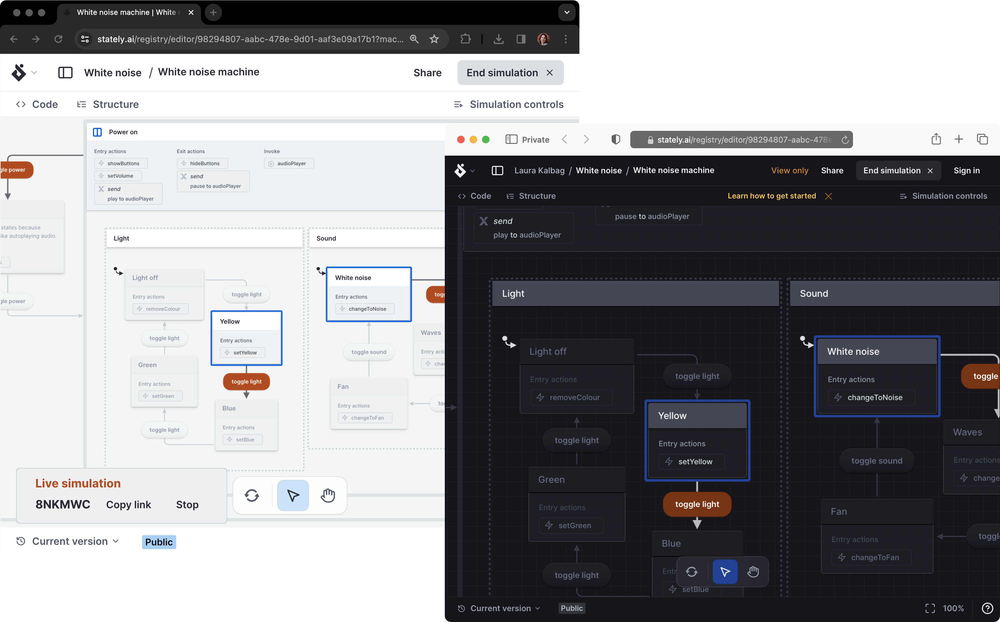

import { Play, Triangle } from 'lucide-react';

Live simulation mode helps you share your simulated machine with your team without screen sharing or screenshots. Share the generated live simulation link, and your team can view your simulation in real-time and even trigger events themselves.

<Callout>

Live simulation is a premium feature of Stately Studio. You can try Stately Studio’s premium plans with a free trial. [Check out the features on our Pro plan](studio-pro-plan), [Team plan](studio-team-plan), [Enterprise plan](studio-enterprise-plan) or [upgrade your existing plan](https://stately.ai/registry/billing).

</Callout>

{/* 

  <ThemedImage
    alt="Two views of the Studio, left is the user sharing the Live simulation and right is the user who joins the Live simulation."
    sources={{
      light: '/assets/live-sim/live-sim-side-by-side.png',
      dark: '/assets/live-sim/live-sim-side-by-side.png',
    }}
  />

 */}

## Simulate your machine with others

You must be signed in to start a live simulation. Enter **Simulate** mode from the <Play size={18}/> **Simulate** button.

<Callout>

When you’re in **Simulate** mode, your current state and next available events are highlighted in blue to simulate the flow of your machine. Click the available events to transition through states and review your logic.

</Callout>

Use the **Live mode** <Triangle size={18}/> button in the bottom left corner to reveal the **Live simulation** options and choose **Start a live simulation** to start a live simulation session.

When your machine is in live simulation mode, the **Live simulation panel** will display in the bottom left corner with a six-character unique code (for example: 3KNYII) along with **Copy link** and **Stop** buttons. The current state and next events will also be highlighted in orange.

Share your live simulation session with whoever you want using the link or unique session code.

## Join a Live simulation using a unique session code

1. Select the **Simulate** mode from the center of the visual editor.
2. Use the **Live mode** button in the bottom left corner to reveal the **Live simulation** options.
3. Choose **Join a Live simulation** to join an existing live simulation mode session.
4. Enter the unique session code you’ve been provided into the text box.
5. Select the **Join** button to join the session.

## Join a Live simulation using a unique session URL

Paste the URL shared with you into your browser address bar and hit enter to join the Live simulation session.
