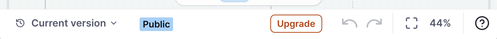
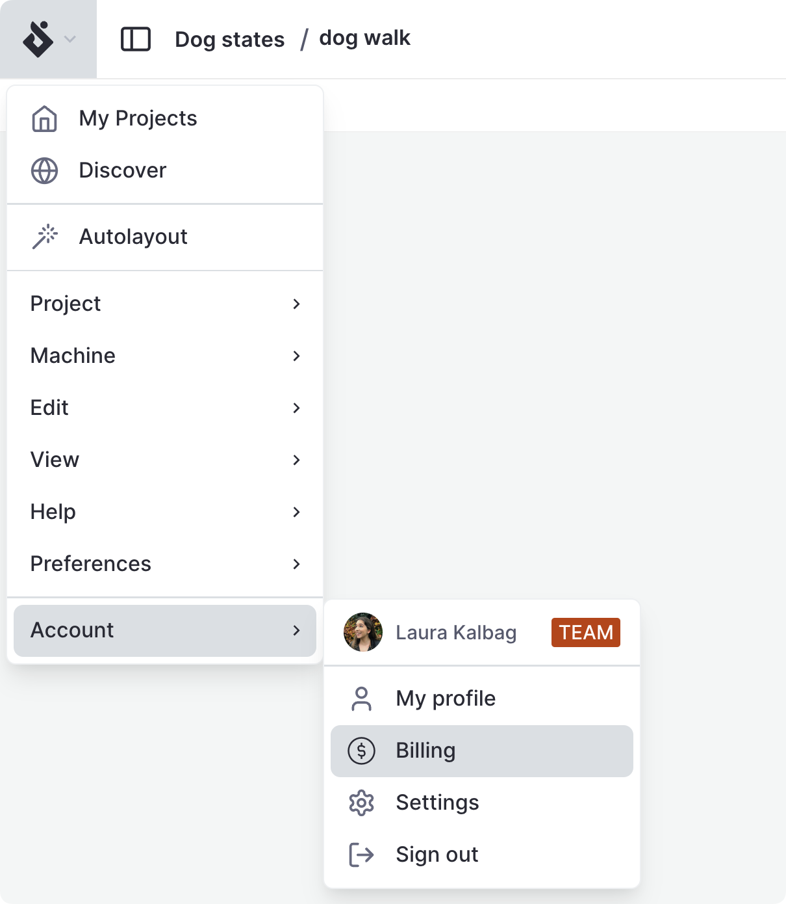

import { CircleDollarSign, ThemedImage } from 'lucide-react';

# Upgrade

Every new Stately Studio account starts with a **free 7-day trial** of the [Pro](studio-pro-plan) plan, no credit card required, so you can explore how our premium features work for you and your team. When the trial ends, your machines and projects become [read-only](studio-community-plan) until you upgrade.

You can upgrade to a [Pro](studio-pro-plan), [Team](studio-team-plan), or [Enterprise](studio-enterprise-plan) plan at any time while you’re signed into Stately Studio.

## Upgrade to a Pro or Team plan

You can [upgrade](upgrade) when you’re signed into Stately Studio using the **Upgrade** button in the editor’s footer.

{/* 

  <ThemedImage
    alt="Upgrade button in the header of Stately Studio between the Save and share buttons."
    sources={{
      light: '/assets/upgrade/upgrade.png',
      dark: '/assets/upgrade/upgrade-dm.png',
    }}
  />

 */}

## Upgrade to an Enterprise plan

  <a href="mailto:support@stately.ai?subject=I'm interested in Stately Studio Enterprise plan">
    Email the Stately team
  </a>{' '}
  for a custom plan tailored to the requirements of your organization.

## Manage your subscription plan

- From the editor, use the Editor menu, and from the **Account** section, select <CircleDollarSign size={18}/> **Billing**.
- From elsewhere in the Studio, select your avatar from the header and choose <CircleDollarSign size={18}/> **Billing** from the account menu.

{/* 

  <ThemedImage
    alt="Billing option in the user account menu in the Stately Studio header."
    sources={{
      light: '/assets/upgrade/billing.png',
      dark: '/assets/upgrade/billing-dm.png',
    }}
  />

 */}

