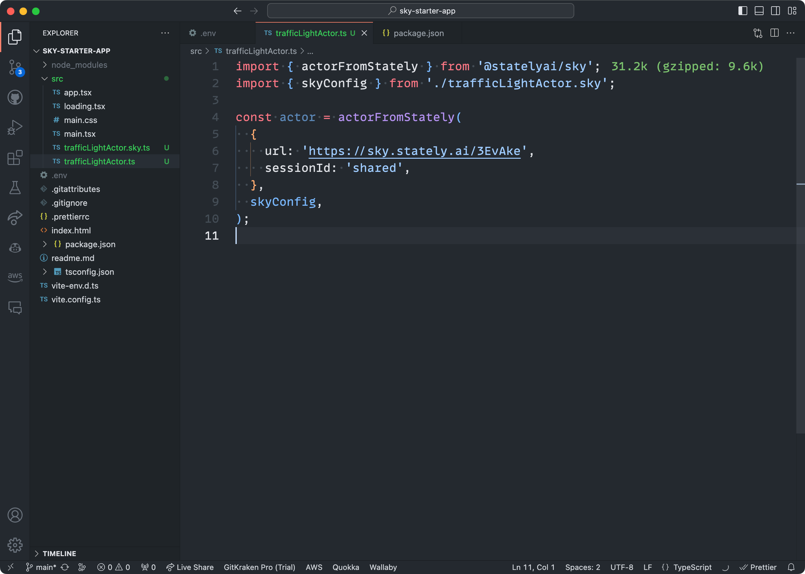

# Getting started with Stately Sky

This guide will walk you through deploying a simple traffic light state machine actor with Stately Sky using [XState](/docs/xstate.mdx), [Vite](https://vitejs.dev/) and [React](https://reactjs.org/).

:::caution

Please note that Sky is currently in alpha and will be changing rapidly.

:::

## What you’ll need

- A [Stately](https://stately.ai) account with a [Pro or Enterprise subscription](https://stately.ai/pricing).
- Our [Stately Sky starter project](https://github.com/statelyai/sky-starter-app). Clone the repo to your local machine.

## Getting started video

<YouTube id="A_J1jbz1oWw" />

## Step 1: Create a machine with Stately

Create a project and compose your machine in the [Stately editor](https://stately.ai/editor) with the transitions and states you want.

For this example, we’ll create a simple traffic light machine with three states: `green`, `yellow`, and `red`. Feel free to fork [our traffic light example](https://stately.ai/registry/editor/eb3e89f5-5936-439f-8254-2f6ea4303659?machineId=15fd8071-b80c-4a6f-b9f5-60b6cf578ee5) to test.

<EmbedMachine
  embedURL="https://stately.ai/registry/editor/embed/eb3e89f5-5936-439f-8254-2f6ea4303659?machineId=15fd8071-b80c-4a6f-b9f5-60b6cf578ee5"
  name="Traffic light"
/>

:::xstate
Sky only supports [XState](https://github.com/statelyai/xstate) V5 machines. The [changes in XState V5](/docs/migration.mdx) provide both a better developer experience and adhere to the [Actor Model](/docs/actor-model.mdx) more closely, allowing Sky to capably deploy machines that reliably communicate their state.
:::

## Step 2: Create an API key

After creating your machine, you’ll need to create an API key to deploy it to Sky.

1. Use the **Run** button in the top right corner of the editor to open the Stately Sky options.
2. Use the **Create API Key** button to generate an API key.


3. Be sure to copy that API key and save it somewhere safe. You’ll need it later.

The page should look like this:


## Step 3: Deploy your machine to Sky

Once you have generated the API key, you can deploy your machine to Sky as a running actor.

1. Use the **Deploy new actor** button to start the deployment process.
2. When the actor is deployed, it will be listed under **Existing deploys**.
3. Use **Copy URL** to copy to the URL to your clipboard.

You’ll need the running actor’s URL to communicate with that actor from the starter project.


## Step 4: Add your API key to the starter project

1. Open [the starter project](https://github.com/statelyai/sky-starter-app) in your code editor.
2. Install the packages using your package manager of choice:

```bash npm2yarn
npm install
```

3. At the project’s root, create a `.env` file to hold your API key.
4. Set the following two variables in the `.env` file; paste your API key as the value for both these keys:

- `SKY_API_KEY`: used by the `@xstate/cli` to fetch the machine config.
- `VITE_SKY_API_KEY`: used by the Vite React app to connect to Sky.


## Step 5: Initialize the actor in the starter project

After adding the API key, you’ll need to initialize the actor.

1. Create a new file in the `src` directory of the starter project. We named ours `trafficLightActor.ts`.
2. In your new file, import the `actorFromStately` function and initialize the actor with the provided URL and your own session ID:

```typescript
import { actorFromStately } from '@statelyai/sky';

const actor = actorFromStately({
  url: 'paste your actor url here',
  sessionId: 'your session id here',
});
```

The session ID can be any string you want. We recommend using a UUID.

:::tip
By default Sky is multiplayer. We use the session ID to allow multiple tenants to reference the same running actor instance.
:::

## Step 6: Fetching the actor config from Sky

Now that we’ve initialized the actor, we need to fetch the config from Sky. Doing so will download and generate the machine configuration file in our repo, giving us type safety when interacting with the running actor!

To fetch the config, we’ll use the [XState CLI tool](/docs/developer-tools.mdx#xstate-cli-command-line-interface) and the `sky` script already in our `package.json`. This script runs the command over all the files in the `src` repo to find configs associated with any initialized actors.


1. Using your package manager of choice, run the `sky` command:

```bash npm2yarn
npm run sky
```

2. Once the `sky` command has completed, you should see:

- a second `skyConfig` argument with updated imports passed to the `actorFromStately` function.
- a new TypeScript file in your `src` directory, named after the actor in the Studio. In our case, it’s `trafficLightActor.sky.ts`.

You’ll notice a warning in the `sky.ts` file that the file is generated. You should not manually edit these files as any local changes will not reflect what’s running in Sky.

Running `xstate sky` will only affect a file if it hasn’t already been fetched. If you make changes to the machine in the Studio, you’ll need to delete the generated file `yourFile.sky.ts` and run the command again. Alternatively, you can force the refetch by running `xstate sky --refetch`.

:::tip

Add your generated `sky.ts` files to source control.

:::



## Finishing up

And that’s it! You can now interact with your running actor in much the same way you would with local actors, like sending events with the `send()` function. Sky is still in its early days, so there are some limitations and things to remember. Specifically:

- Only XState V5 machines are supported.
