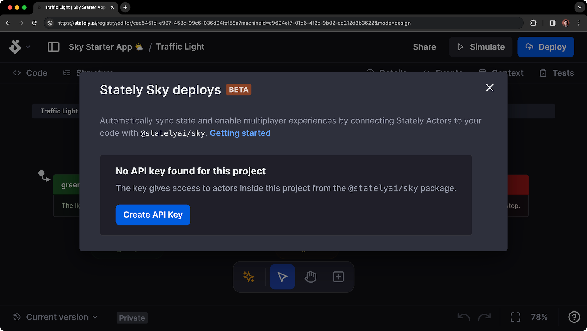
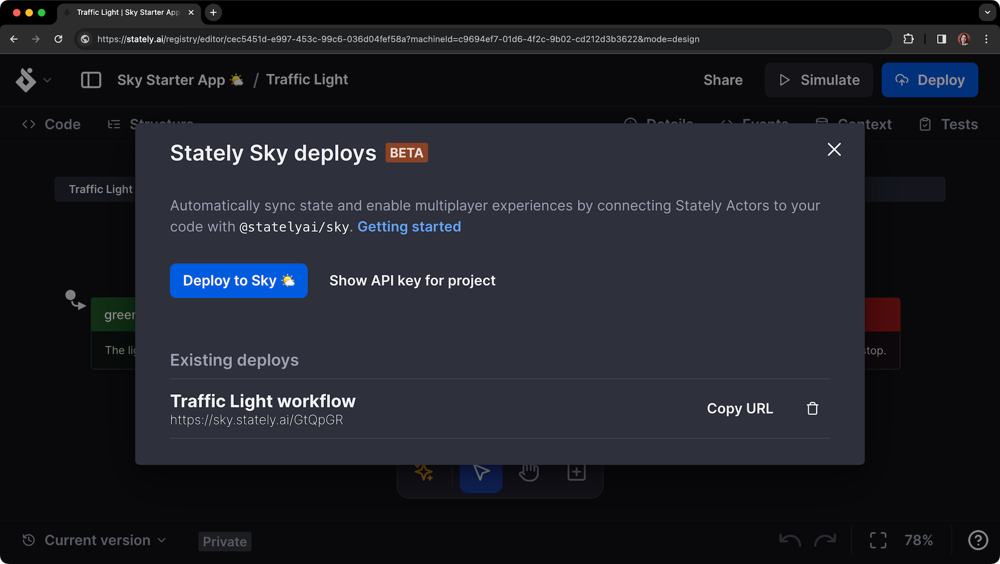
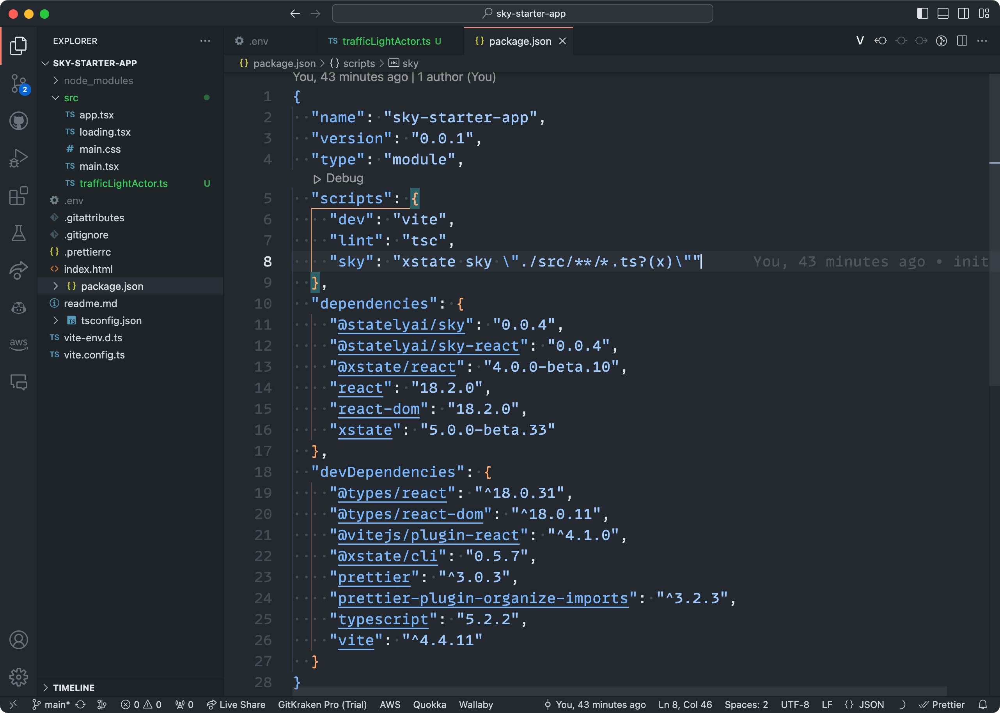

# Getting started with Stately Sky 🌤️

This guide will walk you through deploying a simple traffic light state machine workflow with Stately Sky using [XState](/docs/xstate.mdx), [Vite](https://vitejs.dev/) and [React](https://reactjs.org/).

:::warning

Please note that Sky is currently in beta and will be changing rapidly.

:::

## What you’ll need

- A [Stately](https://stately.ai) account with a [Pro, Team, or Enterprise subscription](https://stately.ai/pricing).
- Our [Stately Sky starter project](https://github.com/statelyai/sky-starter-app). Clone the repo to your local machine.

:::studio

Our premium users get unlimited use of Stately Sky while it’s in beta. You can try Stately Studio’s premium plans with a free trial. [Check out the features on our Pro plan](studio-pro-plan.mdx), [Team plan](studio-team-plan.mdx), [Enterprise plan](studio-enterprise-plan.mdx) or [upgrade your existing plan](https://stately.ai/registry/billing).

:::

## Getting started video

<YouTube id="JJHC0UyGsrQ" />

## Step 1: Create a machine with Stately

Create a project and compose your machine in the [Stately editor](https://stately.ai/editor) with the transitions and states you want.

For this example, we’ll create a simple traffic light machine with three states: `green`, `yellow`, and `red`. Feel free to fork [our traffic light example](https://stately.ai/registry/editor/eb3e89f5-5936-439f-8254-2f6ea4303659?machineId=15fd8071-b80c-4a6f-b9f5-60b6cf578ee5) to test. Check out a [deployed version of this traffic light machine](https://sky-starter.stately.ai/?page=trafficlight).

<EmbedMachine
  embedURL="https://stately.ai/registry/editor/embed/eb3e89f5-5936-439f-8254-2f6ea4303659?machineId=15fd8071-b80c-4a6f-b9f5-60b6cf578ee5"
  name="Traffic light"
/>

:::xstate
Sky only supports [XState](https://github.com/statelyai/xstate) V5 machines. The [changes in XState V5](/docs/migration.mdx) provide both a better developer experience and adhere to the [Actor Model](/docs/actor-model.mdx) more closely, allowing Sky to capably deploy machines that reliably communicate their state.
:::

:::typescript

**XState v5 requires TypeScript version 5.0 or greater.**

For best results, use the latest TypeScript version. [Read more about XState and TypeScript](typescript.mdx)

:::

## Step 2: Create an API key

After creating your machine, you’ll need to create an API key to deploy it to Sky.

1. Use the **Deploy** button in the top right corner of the editor to open the Stately Sky options.
2. Use the **Create API Key** button to generate an API key.



3. Be sure to copy that API key and save it somewhere safe. You’ll need it later.

The page should look like this:


## Step 3: Deploy your machine to Sky

Once you have generated the API key, you can deploy your machine to Sky as a workflow.

1. Use the **Deploy to Sky 🌤️** button to start the deployment process.
2. When the workflow is deployed, it will be listed under **Existing deploys**.
3. Use **Copy URL** to copy to the URL to your clipboard.

You’ll need the workflow’s URL to reference it from the starter project.



## Step 4: Add the actor in the starter project

After adding the API key, you’ll need to create an actor.

1. Create a new file in the `src` directory of the starter project. We named ours `trafficLightActor.ts`.
2. In your new file, import the `actorFromStately` function and initialize the actor with the provided URL and your own session ID:

```typescript
import { actorFromStately } from '@statelyai/sky';

const actor = actorFromStately({
  apiKey: 'paste your API key here',
  url: 'paste your Sky url here',
  sessionId: 'your session id here',
});
```

:::tip
By default, Sky is multiplayer.
The session ID is used to shard the multiplayer session. Each actor has a unique session ID.

- Use a shared session ID to allow multiple users to reference the same actor.
- If you want users isolated, use a unique session ID for each user.

:::

## Step 5: Fetching the config from Sky

Now that we’ve created the actor, we need to fetch the config from Sky. Doing so will download and generate the machine configuration file in our repo, giving us type safety when interacting with the running actor!

To fetch the config, we’ll use the [XState CLI tool](/docs/developer-tools.mdx#xstate-cli-command-line-interface) and the `sky` script already in our `package.json`. This script runs the command over all the files in the `src` repo to find configs associated with any initialized actors.



1. Using your package manager of choice, run the `sky` command:

```bash npm2yarn
npm run sky
```

2. Once the `sky` command has completed, you should see:

- a second `skyConfig` argument with updated imports passed to the `actorFromStately` function.
- a new TypeScript file in your `src` directory, named after the actor in the Studio. In our case, it’s `trafficLightActor.sky.ts`.

You’ll notice a warning in the `sky.ts` file that the file is generated. You should not manually edit these files as any local changes will not reflect what’s running in Sky.

Running `xstate sky` will only affect a file if it hasn’t already been fetched. If you make changes to the machine in the Studio, you’ll need to delete the generated file `yourFile.sky.ts` and run the command again. Alternatively, you can force the refetch by running `xstate sky --refetch`.

:::tip

Add your generated `sky.ts` files to source control.

:::

## Finishing up

And that’s it! You can now interact with your running actor in much the same way you would with local actors, like sending events with the `send()` function. Sky is still in its early days, so there are some limitations and things to remember. Specifically:

- Only XState V5 machines are supported.
- If you're using React Native, see [this comment](https://github.com/statelyai/sky/issues/6#issuecomment-1766967479) if you're having issues.
