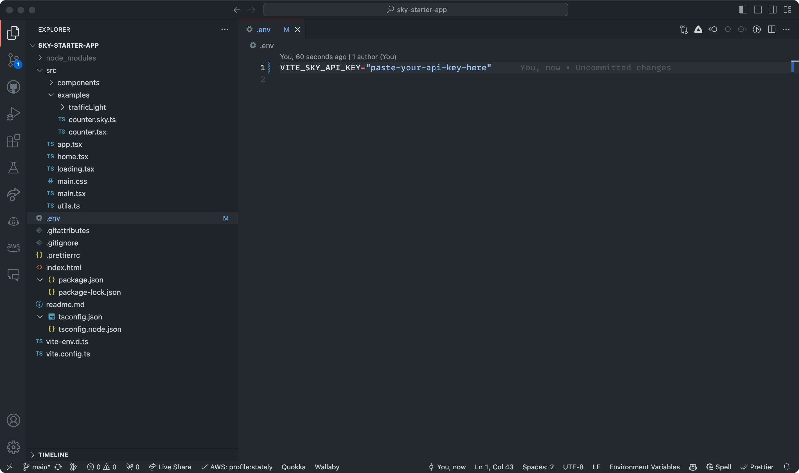

# Getting started with Stately Sky

This guide will walk you through the process of creating a simple traffic light actor using Stately Sky.
__Please note that Sky is currently in alpha and will be changing rapidly__.

## Prerequisites

1. A Stately account with a [Pro or Enterprise subscription](https://stately.ai/pricing)
2. The starter project. [Clone the repo on your local machine](https://github.com/statelyai/sky-starter-app/tree/main)
3. A machine to deploy as an actor. To test, feel free to fork our [stop light example](https://stately.ai/registry/editor/eb3e89f5-5936-439f-8254-2f6ea4303659?machineId=15fd8071-b80c-4a6f-b9f5-60b6cf578ee5)
4. A package manager, like [NPM](https://www.npmjs.com/package/npm) or [Yarn](https://yarnpkg.com/)

## Step 1: Create a machine in the Studio

Create a project and compose your machine in the Studio with the transitions and states you want. For this example, we'll create a simple traffic light machine with three states: `green`, `yellow`, and `red`.


__NOTE__: Sky only supports XState V5 machines. The changes in V5 provide both a better developer experience and adhere to the Actor Model more closely, allowing for Sky to capably deploy machines that reliably communicate their state.

## Step 2: Create an API key

When you've finished creating your machine, you'll need to create an API key to deploy it to Sky. You can do this by clicking the "Run" button in the top right corner of the Studio. A screen will appear, prompting you to create an API key. Select that button.


Be sure to copy that API key and save it somewhere safe. You'll need it later. The page should look like this: 


## Step 3: Deploy your machine to Sky

Now that the API key is generated, you can deploy your machine to Sky as a running actor. Select the "Deploy new actor" button to start the process. Once the actor is deployed, the page will display the name of the running actor and the URL you can use to interact with it. You'll need to use that URL to communicate with the actor from the starter project.


## Step 4: Add your API key to the starter project

Open the starter project in your code editor. At the root of the project, create a `.env` file to hold your API key.
There are 2 variables that need to be set in the `.env` file: `SKY_API_KEY` and `VITE_SKY_API_KEY`. Paste your API key as the value for both these keys.



__NOTE__: The starter project relies on Vite to run the app. Vite uses the `VITE_` prefix for environment variables, so any code processed by Vite will not have access to any environment variables without that prefix. 
For code that Vite doesn't touch, however, we rely on the `SKY_API_KEY` variable. This is why we set both variables to the same value.

## Step 5: Initialize the actor in the starter project

After adding the API key, you'll need to initialize the actor. Create a new file in the `src` directory of the starter project. We named ours `trafficLightActor.ts`. In that file, import the `actorFromStately` function and initialize the actor with the provided URL and your own session ID. The session ID can be any string you want. We recommend using a UUID: 

```typescript
import { actorFromStately } from '@statelyai/sky';

const actor = actorFromStately({
     url: "paste your actor url here",
     sessionId: "your session id here",
});
```

__NOTE__: By default Sky is multiplayer. We make use of the session ID to allow multiple tenants to reference the same running actor instance.


## Step 6: Fetching the actor config from Sky

Now that we've initialized the actor, we need to fetch the config from Sky. Doing so will download and generate the machine configuration file in our repo, giving us typesafety when interacting with the running actor! 

To fetch the config, we'll use the XState CLI tool. In our `package.json`, we already have a reference to the script we need to run, named `sky`. This runs the command over all the files in the `src` repo to find configs associated with any initialized actors.


 Using your package manager of choice, run the `sky` command. For convenience, feel free to use one of the npm or yarn commands below:
```
yarn run sky
```
```
npm run sky
````

Once completed, you should see a second argument passed to the `actorFromStately` function, with the name `skyConfig` and updated imports. You should also see a new TypeScript file in your `src` directory, named after the actor in the Studio. In our case, it's `trafficLightActor.sky.ts`.


## Finishing up

And that's it! You're now able to interact with your running actor in much the same way you would with local ones, like sending events with the `send()` function. This is still in early days, so there are some limitations and things to remember. Specifically:

- Sometimes, the `send()` function might return `undefined`. This means that the client code is still connecting to Sky. If this happens, it may be best to consider implementing a retry policy.
- Only XState V5 machines are supported.
- Delayed transitions are not yet supported, but will be soon. 
- While the generated `sky.ts` files are not meant to be manually edited, they are expected to be added to source control. 
