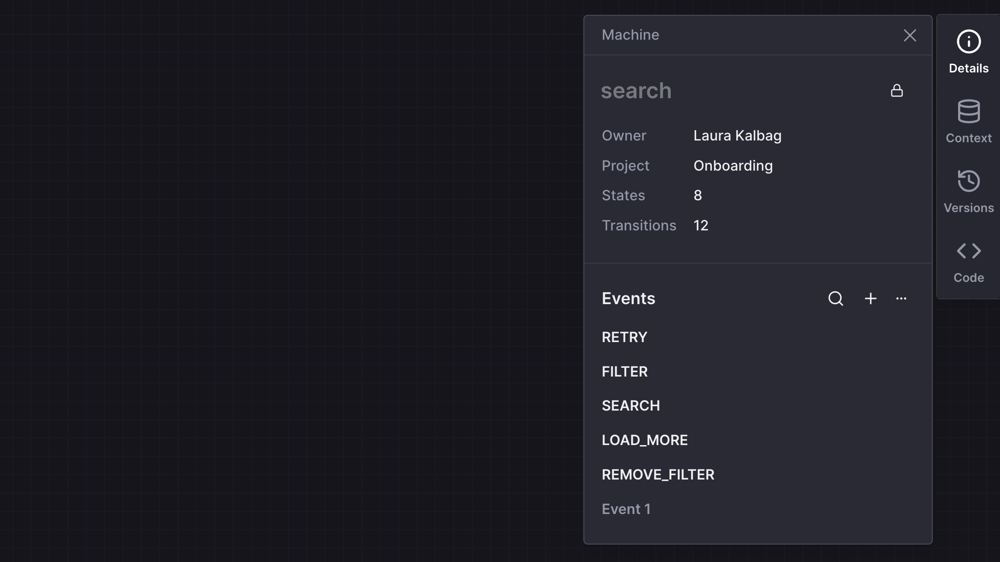
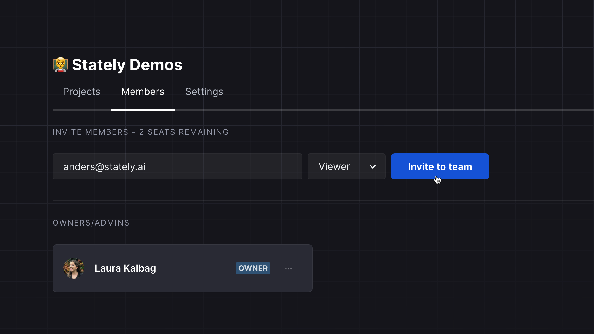
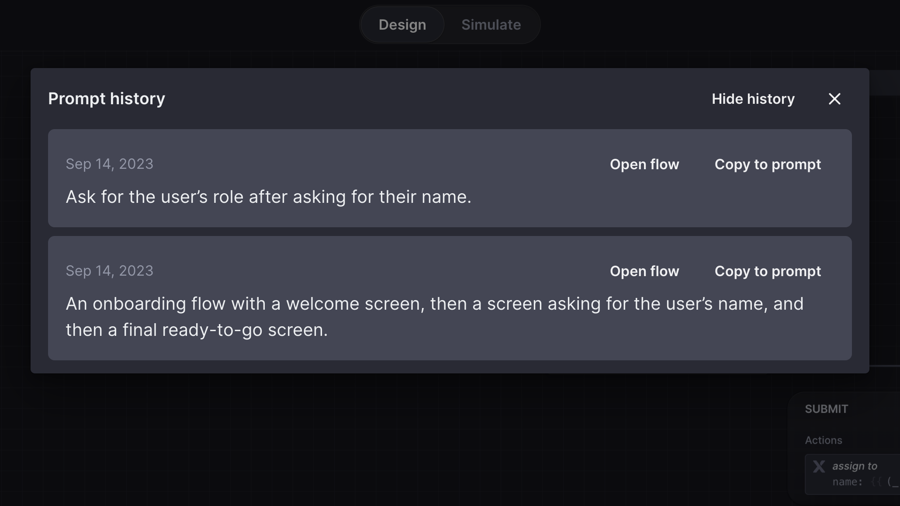

The Stately team has had another busy week. The editor now has event schemas, and we’ve made many more improvements. Let’s dig in!

{/* truncate */}

## Event schemas

Event schemas are now available in the editor. You can access the event schemas from the **Machine details** panel. The event schema enables you to define events for the current machine, including all of the events’ properties, including, but not limited to, the event description.

You can search for available events from the event schema panel, edit their details, and create new events. Any events you aren’t using in your machine have less opacity, and you can delete all unused events from the <MoreHorizontal size={18} /> button and choose **Delete all unused**.

You can also view the schema for any event by selecting that event on the canvas and opening the **Event details** panel.

## Team viewer role is now free

The **Viewer** role in Stately Teams is now free and does not count towards your number of seats. You can now see how many available seats you have left on your team from the Team page and the Billing page.

## Improvements to generating flows

We’ve improved the interface for generating flows to make it easier and faster. You can now access the history of text descriptions you used for your current machine from the **View history** button in the **Generate flow** dialog. Use the **Copy to prompt** button to copy a preview prompt into the description field to try it again!

## Improvements to the machines list

- Machines are now sorted alphabetically from A to Z in the machines list.
- Locked machines now have a locked icon alongside their name in the machines list.

## More improvements

The machine’s root state now has a minimal borderless appearance by default, giving you more space to focus on your machine. If you change the root state’s color or add a description, action, or any other block type, the root state will revert to its classic bordered design and the same features as any other parent state.

- Annotations are now borderless, so they appear directly on the canvas.
- Transition labels now have more definition to make them easier to read.
- You can now jump directly to the Discover page from **Discover** in the Editor menu.

## Bug fixes

We fixed a bug where a machine name was not correctly updated when you renamed its root state.
