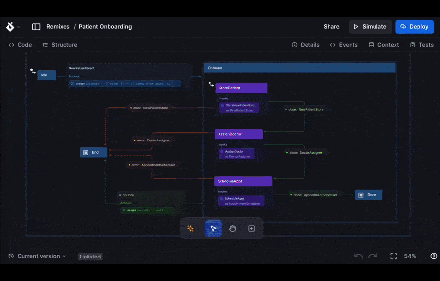

The Stately team is very excited to announce a new feature we’ve been working on for quite some time! Join us in welcoming Stately Sky to the Studio. Lovingly built with [PartyKit](https://www.partykit.io/), Sky is our new serverless platform for running workflows within the Studio. With Sky, users may now run their statecharts as live machines in minutes, complete with XState v5 actors and multiplayer support.

{/* truncate */}

## Why Sky: a seamless developer experience without the lock-in

We know that state machines are extremely powerful for defining app logic, and Sky supercharges the Studio by allowing developers to **_build and deploy_** workflows to the edge, all defined as state machines! Typically, when we think of building workflows or long running processes, we typically think of two possible paths:

- coding against large cloud services with cumbersome development environments, tons of boilerplate, and painful deployment processes
- relying on low-code or no-code platforms that tend to be inflexible and require vendor lock-in

Sky aims to remove the barriers on both ends of the spectrum. We’ve always allowed developers to export their diagrams in the Studio as code, as JSON, and [more recently, as stories](https://stately.ai/docs/export-as-code#export-formats). There is no vendor lock-in from the Studio. Additionally, deploying workflows couldn’t be easier. Once the user has built and tested their machines in the Studio, they need only to generate an API key and click deploy.



After that, developers can interact with their “live actor” in the same way they’ve been able to work with other XState machines. There is an SDK for Sky-based actors, but the syntax is virtually the same, save for the initial connection and configuration:

```tsx
const actor = actorFromStately(
  {
    url: 'url of the running actor',
    sessionId: 'unique session id for multiplayer',
  },
  skyConfig, //provided after initializing sky in your local dev environment
);
```

The snippet above is all that’s needed in code to connect an application to the live running actor in Stately Sky. For details on all the configuration steps, check out the [“Getting Started” guide](https://stately.ai/docs/stately-sky-getting-started) that walks through the full setup.

## Multiplayer: batteries included

Sky removes the complexity of spinning up a running web server in a cloud platform or hosting it on premise. Thanks to [PartyKit](https://docs.partykit.io/), real-time communication and multiplayer come built-in for the developer. Users don’t have to concern themselves with wrangling and scaling concurrent live connections in Sky. If a client needs to interact with a live actor, they need only the `sessionId` and the rest is handled for them. Both Sky and PartyKit are built using CloudFlare, allowing us to scale with the needs of the user.

## What can you do with Sky?

Since Sky actors are built using the same tools, the good news is that everything users can build in the editor can work with Sky The developer experience is exactly the same. After connecting to their live actors, users can inspect and send events just like they can with any other XState machine.

### Use cases

There are several instances where users would benefit from a live actor, particularly one that can accept requests from multiple sources. Running state machines as actors in Sky gives developers the readability of statecharts with the durability and fault tolerance of cloud compute. For example, long-running workflows where time is a serious constraint can be easily implemented and maintained within Sky. Workflows like:

- Multiplayer-collaboration sessions, like whiteboarding, document editing, and gaming.
- Asynchronous workflows, like fetching large amounts of data in the background
- Long-running backend processes like medical patient onboarding flows or inventory management

### How does it work?


Sky makes use of Cloudflare and PartyKit to handle the webserver lifecycle, orchestration, and compute. All those details are abstracted away from the user. Sky’s role is to consume user-defined statecharts and publish them as live actors. So, whenever it is time to interact with that live actor, the user would do so with the Sky SDK. That component is the “tie-in” between the live actor and the rest of the user application. The Sky SDK exposes the live actor to receive events no different from a standard XState actor.

## See Sky in action

Feel free to check out the [Stately Sky Starter app for interactive demos built on Sky](https://sky-starter.stately.ai/?page=trafficlight). They also serve as a great starting point for building your own Sky actors. Our very own Laura Kalbag also built [an interactive collaborative sleep demo built with Sky](https://laurakalbag.github.io/collaborative-sleep-sky/). Be sure to try the demo with multiple tabs open to simulate different users!

## Resources

Check out the resources put together by the team, including our office hours call where we show a preview of Sky in action. For a step-by-step primer, check out the [“Getting Started” guide](https://stately.ai/docs/stately-sky-getting-started) that walks through the full setup.

<YouTube id="_iTjIWq6M1g" />
