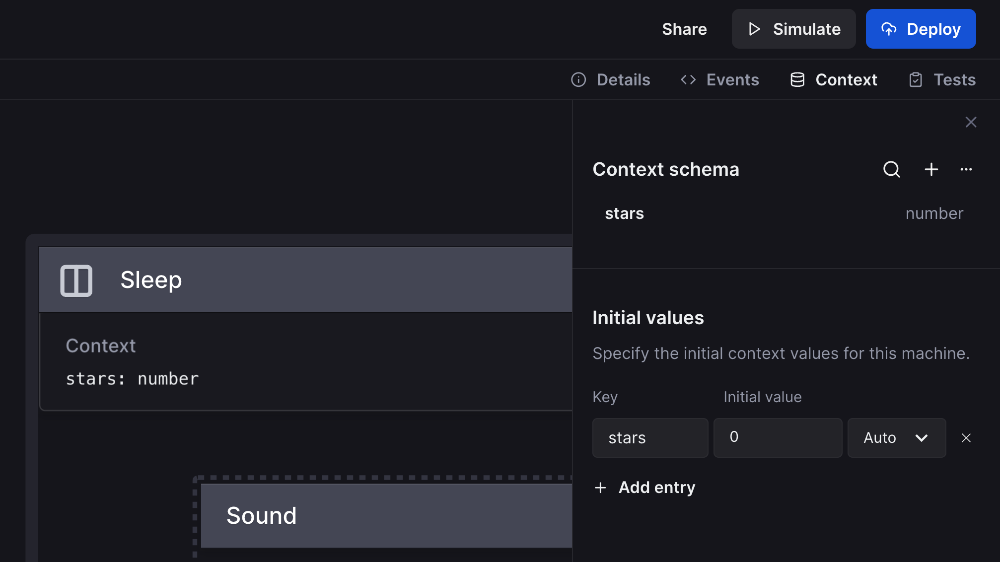
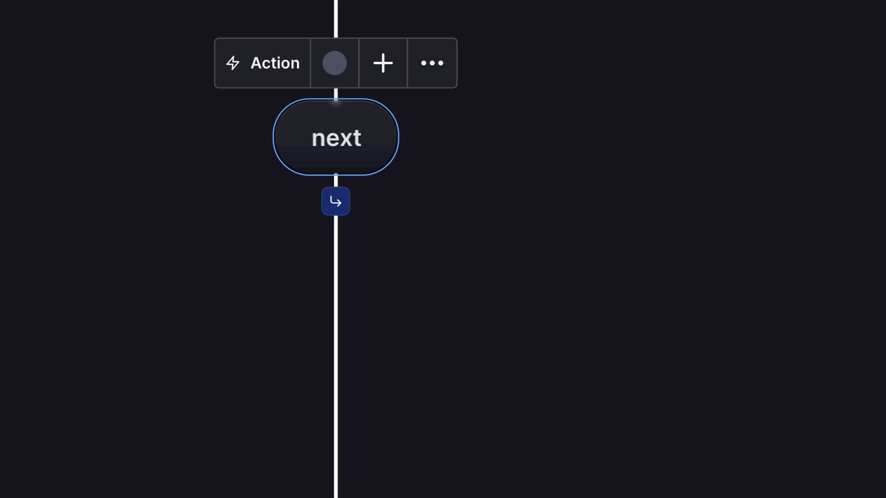

It’s the end of 2023, and we have a few more updates to share with you before the year ends. {/* truncate */}We’ve added various new features to make your editor experience even better.

## XState V5 is here

XState V5 is no longer in beta, so instead of an XState V5 beta toggle in the **Code** panel, you can now choose to use XState V5 or XState V4 from a dropdown menu. We recommend using XState V5 for all new projects, but you can still use V4 for existing projects. [Read more about the XState V5 release](../../docs/assets/blog/2023-12-01-xstate-v5).

## Context on canvas

Your machine’s context is now displayed on the canvas. You can add your context schema and initial values from the **Context** panel in the editor.

## Add transition

When a transition selected, you can now use the arrow icon button to add another transition for quick conditional logic. Using the button will add a transition from the same source state, making the original transition into an _if_ transition and the new transition into an _else_ transition, where you can then add your [guard logic](/docs/guards).

## Show and hide effects

You can now use the **Show/hide effects on canvas** option in the editor menu view settings to expand and collapse the appearance of effects on the canvas. The default setting is that all actions and invoked actors are visible on states and events with their names and any special properties. When effects are hidden, a summary of the number of actions and invoked actors is shown instead; for example, `1 invoke 5 actions`.

## Improvements

- You can now move a project from the project options in the **My Projects** view.
- We updated the Help tutorials to reflect the latest changes to the editor.
- If we don’t have your name from your auth provider, we now generate a random state machine-related name for you that is displayed with your public projects. Don’t like your random name? You can change it in the **Settings**.
- It’s now easier to drag the edge of the left panel to resize it.
- A variety of internal improvements to make the app faster and more reliable.

## Bug fixes

- We fixed a bug where you could sometimes be redirected to the Project settings page when creating a new machine.
- You can now remove [state and event descriptions](/docs/descriptions) without any issues. To delete a description, remove its text. To remove the description area from a state or event, delete its text from the details panel.
- We fixed a bug with the CodeSandbox and StackBlitz exports when using XState V5.
- You can now undo when you use the **Clear** button on a machine at [state.new](https://state.new).
