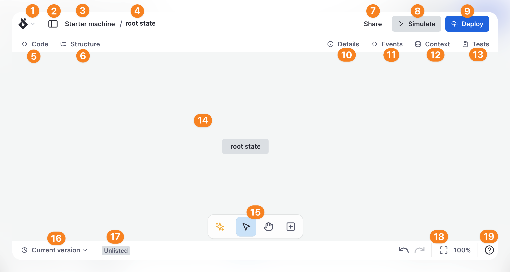

import { ClipboardCheck, Code, Database, History, Info, ListTree, Play, UploadCloud, HelpCircle } from 'lucide-react';

Design your state machine flows in Design Mode.

You can add new [states](states.mdx) by double-clicking anywhere on the canvas, and add [transitions and events](transitions.mdx) from the handles on each side of the states.

{/* 

  <ThemedImage
    alt="Numbered screenshot of Stately editor’s Design mode features. Described by list below."
    sources={{
      light: '/design-mode-signed-in.png',
      dark: '/design-mode-signed-in-dm.png',
    }}
  />

 */}

1. **Editor menu**: access common Stately shortcuts and view options.
2. **Left drawer switch**: open and close the left drawer which contains the machines list.
3. Current [project](projects.mdx).
4. Current machine.
5. <Code size={18} /> **Code** panel.
6. <ListTree size={18} /> **Structure** panel.
7. **Share** button: Open the share options.
8. <Play size={18} /> [**Simulate**](simulate-mode.mdx).
9. <UploadCloud size={18} /> [**Deploy**](stately-sky-getting-started.mdx).
10. <Info size={18} /> **Details** panel for the currently selected machine, state,
    or transition.
11. <Code size={18} /> **Events** schema panel.
12. <Database size={18} /> [**Context**](context.mdx) schema panel.
13. <ClipboardCheck size={18} /> [**Tests**](/docs/generate-test-paths) panel.
14. Canvas: where your state machine is designed and displayed.
15. [Canvas tools](canvas-view-controls.mdx).
16. <History size={18} /> Current [version](versions.mdx) displayed on the canvas.
17. [Project visibility](projects.mdx).
18. [Canvas view controls](canvas-view-controls.mdx).
19. <HelpCircle size={18} /> Help button: open and close the help drawer.
