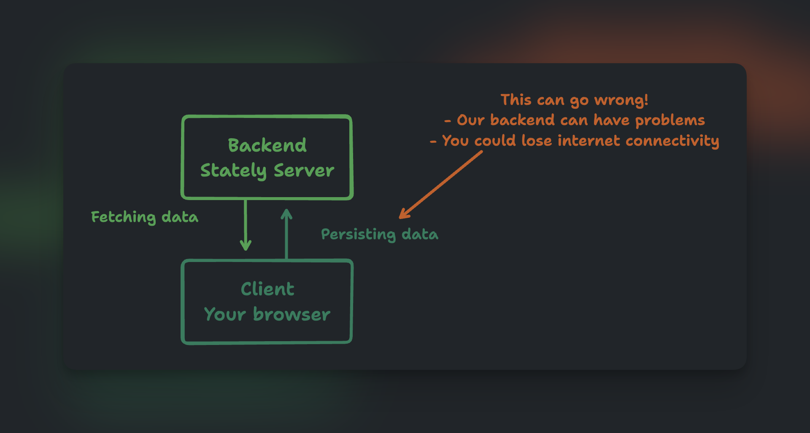
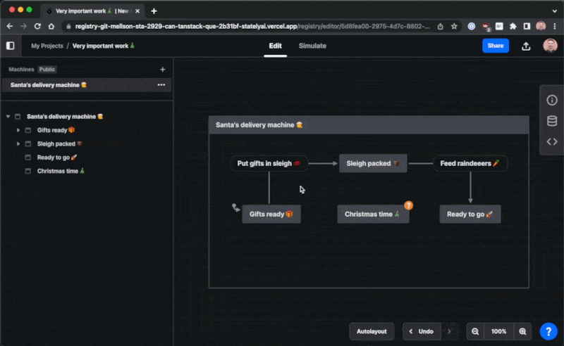
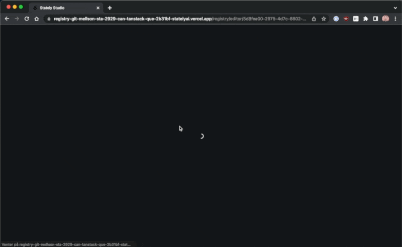

The Studio is built using a server-client architecture.
Whenever you edit a machine, we will persist these changes to our database, ready for you to use when you return - on any device with an internet connection.

But what happens with your edits if your internet connection fails or the Stately backend is having problems?
This is where machine restore comes into play.

### Example

In our example, Santa’s delivery machine has a problem; the Christmas-time state is unreachable.
So we do as any good Santa’s helper would; we create an event to get to Christmas.
But alas, we’re offline, so our changes could get lost.
Before this new feature, there was a chance you wouldn’t notice you’d gone offline or that the server returned an error.
But as you can see in the GIF below, we’ve introduced new error banners to show you what’s happening.

If you lose connectivity, we’ll show the error banner saying, “You are offline, so we can’t save your machine; we will try our best to store a local copy you can restore later.”
So feel free to keep editing; you can restore your work the next time you visit this machine on the same device.

### How to restore

We try our best to detect any failure or missing connectivity when you edit your machines.
If you hit any error state, we will inform you and start saving your work locally on your device.
So next time you visit the Studio from that same device, we will compare what we saved with the machine from the server.
And if they are different, we will give you the option to restore the safe copy to a new machine.

When we detect that you have local changes on your device, we’ll present a modal titled “Restore offline machine?”.
Now you have two options:

1. **“No, delete the offline copy”** - This option will ignore, and delete, the changes found on your device and not show the modal again.
2. **“Yes, restore into a new machine”** - This option will create a new machine in your current project with the changes.

You can see this in action using our example from above.
When I return to the Studio, I can restore the changes I did while offline. Christmas is saved.

<Callout>

Read more in [our blog post introducing machine restore](https://stately.ai/blog/2022-12-22-machine-recovery).

</Callout>
