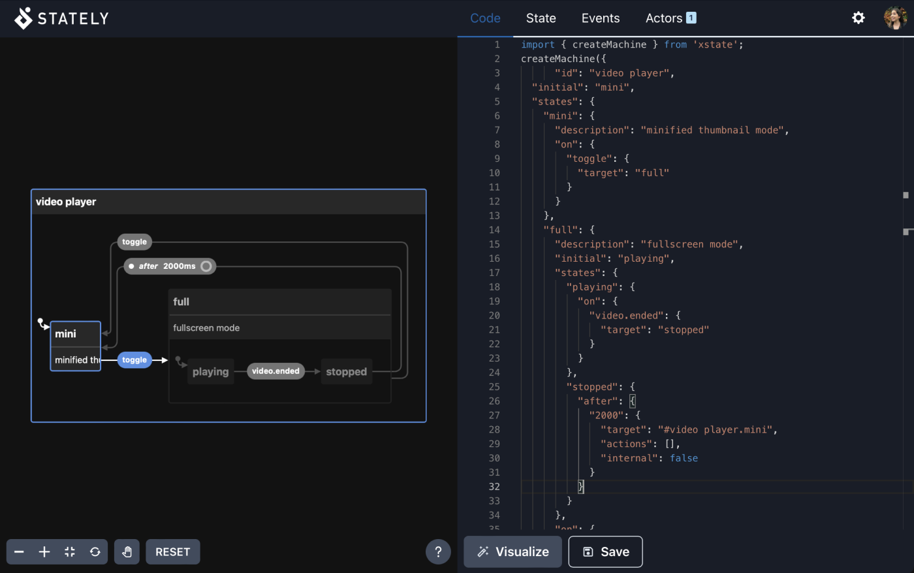

# Visualizer (Legacy)

:::studio

Are you looking for the _Stately Studio_ visual _editor_? Check out the [Stately Studio overview](/).

:::

The [Stately Visualizer](https://stately.ai/viz) is a tool for creating and inspecting statecharts to visualize the state of your applications. You can use the viz as a playground for exploring XState’s capabilities.

:::warning

The XState Visualizer is deprecated and is no longer maintained.

:::

We recommend you only continue using the legacy visualizer if you need to execute actions and guards or visualize multiple machines simultaneously. These features are coming to the [Stately editor](studio.mdx) very soon.

## Use the Visualizer

- [Take me to the Visualizer](https://stately.ai/viz)
- [Try the Visualizer in Inspect mode](https://stately.ai/viz?inspect).

The Visualizer is deprecated and we encourage you to migrate your projects to use the [Stately editor](studio.mdx).

## Feedback and bug reports

If you have any feedback or feature requests, please [join our Discord server](https://discord.gg/xstate), where you’ll find our team and the wonderful Stately community.

Please [submit any bug reports as GitHub issues on the XState repository](https://github.com/statelyai/xstate/issues).
